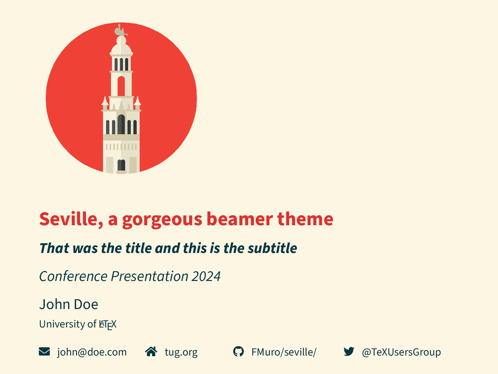

## Seville LaTeX beamer theme 



Do you like this? Have a look at the [PDF](demo/demo.pdf) and the [LaTeX code](demo/demo.tex).

## How to use

Copy `beamerthemeseville.sty` to your beamer presentation's folder, add

```
\usetheme{seville}
```

to the preamble.

If you're going to use it often, you can place `beamerthemeseville.sty` somewhere in your TeX distribution tree instead. 

## Options

```
\usetheme[options]{seville}
``` 
where `options` may be some of these (comma-separated):


- `alegreya` uses Huerta Tipográfica's [Alegreya Sans](https://www.huertatipografica.com/es/fonts/alegreya-sans-ht) font.
- `lmodern` uses the Latin Modern font, for a more classical LaTeX look.
- `fira` uses Mozilla's [Fira Sans](https://mozilla.github.io/Fira/) font and its [Fira Math](https://github.com/firamath/firamath) companion.
- `noto` uses Google's [Noto](https://fonts.google.com/noto) font.
- `lualatex` uses the default fonts, Adobe's [Source Sans](https://fonts.adobe.com/fonts/source-sans), [Source Code Pro](https://fonts.adobe.com/fonts/source-code-pro) and [Source Serif](https://fonts.adobe.com/fonts/source-serif) fonts, with **LuaLaTeX** . The math font is [STIX Two Math](https://www.stixfonts.org).
- `xelatex` same as above but with **XeLaTeX**.
- `material` uses Google's [Material Design color system](https://m2.material.io/design/color/the-color-system.html) while keeping a similar look.
- `academicons` uses [Academicons](https://jpswalsh.github.io/academicons/) for some links.

Since the first six options select the main fonts, you should only use one of them. The last two ones are compatible between them and with the rest.

The options `fira`, `noto`, `lualatex`, and `academicons` require compilation with **LuaLaTeX**. With `fira`, `noto`, and `academicons` you can use **XeLaTeX** instead, and you must with the `xelatex` option, but this forces you to install the Fira, Noto, Source, and STIX Two fonts in your system, if you use these options. In fact, if you use Fira, you also have to install [Euler Math](https://www.ctan.org/tex-archive/fonts/euler-math) (used for calligraphic and fraktur math fonts) and [XITS](https://github.com/aliftype/xits) (used for missing symbols in Fira Math).

*Warnings for [**Tectonic**](https://tectonic-typesetting.github.io/en-US/) users!* As of Tectonic 0.15.0:

- You *must* download and save the file [`beamerinnerthemetcolorbox.sty`](https://mirrors.ctan.org/macros/latex/contrib/beamer-contrib/themes/beamertheme-tcolorbox/beamerinnerthemetcolorbox.sty) to your project's folder.
- You must use *one and only one* of the following options:
  - `xelatex` installing in your system the default Adobe's [Source Sans](https://github.com/adobe-fonts/source-sans/releases/latest), [Source Code Pro](https://github.com/adobe-fonts/source-code-pro/releases/latest) and [Source Serif](https://github.com/adobe-fonts/source-serif/releases/latest) fonts, and the [STIX Two Math](https://www.stixfonts.org/#install) font.
  - `noto` installing the [Noto](https://notofonts.github.io) fonts.
  - `fira` installing the [Fira](https://github.com/mozilla/Fira/releases) and [Fira Math](https://github.com/firamath/firamath/releases) fonts.
  - `lmodern` without installing anything.
- You *can't* use the `alegreya` or `lualatex` options.

## Acknowledgements

This theme is inspired by Matthias Vogelgesang's beautiful [Metropolis theme](https://github.com/matze/mtheme/). It uses the [Solarized](https://ethanschoonover.com/solarized/) color palette, Adobe's [Source Sans](https://fonts.adobe.com/fonts/source-sans), [Source Code Pro](https://fonts.adobe.com/fonts/source-code-pro) and [Source Serif](https://fonts.adobe.com/fonts/source-serif) fonts, the [Euler Virtual Math](https://www.ctan.org/pkg/eulervm) font based in Hermann Zapf's designs, icons by [Font Awesome](https://fontawesome.com), and a lovely logo by [Graficatessen](https://graficatessen.es/), along with many other FOSS things. I'm grateful to all creators that make this possible.

## Why this theme?

The Metropolis theme is unfortunately unmaintained. Changes in its dependencies have caused glitches. Seville is extremely simple. It is therefore easy to maintain although it has way less options. Seville is probably a drop-in replacement for people that was using Metropolis without tweaking too much.

I've also added some goodies for mathematicians and academics in general. 

## Contributing

If you'd like to use this theme but you feel you need some missing options or features, let me know by opening an issue. Or even better, make a pull request adding what you need.

## TODO

- [ ] Cleanup and comment `beamerthemeseville.sty`.
- [ ] Check missing symbols in Fira Math and find replacements.
- In case anyone is interested:
  - [ ] Documentation.
  - [ ] Extra features.
  - [ ] [CTAN](https://www.ctan.org).
  - [ ] Overleaf.

## License

Copyright 2022 F. Muro

This work may be distributed and/or modified under the
conditions of the LaTeX Project Public License, either version 1.3
of this license or (at your option) any later version.
The latest version of this license is in

[http://www.latex-project.org/lppl.txt](http://www.latex-project.org/lppl.txt)

and version 1.3 or later is part of all distributions of LaTeX
version 2005/12/01 or later.

This work has the LPPL maintenance status `maintained'.
 
The Current Maintainer of this work is F. Muro.

This work consists of the file beamerthemeseville.sty.
